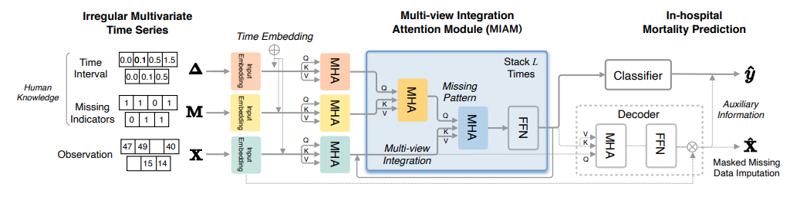

## MIAM

This repository provides the official PyTorch implementation of the following paper:
> **Multi-view Integration Learning for Irregularly-sampled Clinical Time Series (MIAM)** 
> [Yurim Lee](https://github.com/yurimaLee/)1, [Eunji Jun](https://scholar.google.co.kr/citations?user=uR6W4TUAAAAJ&hl=ko)1, [Heung-Il Suk](https://scholar.google.co.kr/citations?user=dl_oZLwAAAAJ&hl=ko)1 
> (1Korea University)  
> [[arXiv version]](https://arxiv.org/pdf/2101.09986.pdf)
> 
> Under review, Journal of Biomedical and Health Informatics

## Files description
### MIAM
  * main.py
  * models.py: contains the MIAM
  * helpers.py: helper functions for running models
### Extended
  Includes the extended version for Journal (Under Review)
  * lrp.py: Layer-wise Relevance Propagation code for analysis

## Acknowledgements
This work was supported by Institute of Information & communications Technology Planning & Evaluation (IITP) grant
funded by the Korea government(MSIT) (No. 2019-0-00079, Artificial Intelligence Graduate School Program(Korea University))
